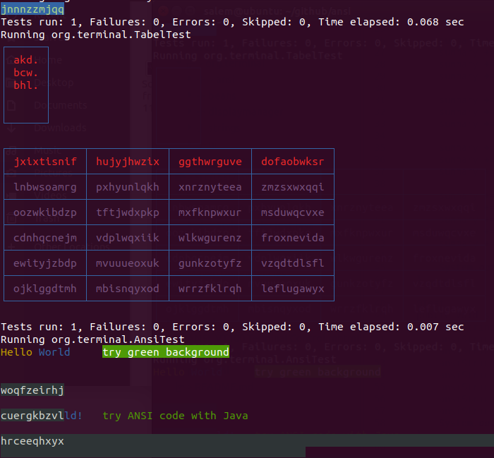

# ANSI/VT100 for Java (0.1.99)


Control Sequences (defined by ANSI X3.64-1979)
----------------------------------------------

Control Sequences are started by either ESC [ or CSI and are terminated by an
"alphabetic" character (100 to 176 octal, 40 to 7E hex).  Intermediate
characters are space through slash (40 to 57 octal, 20 to 2F hex) and parameter
characters are zero through question mark (60 to 77 octal, 30 to 3F hex,
including digits and semicolon).  Parameters consist of zero or more decimal
numbers separated by semicolons.  Leading zeros are optional, leading blanks
are not allowed.  If no digits precede the final character, the default
parameter is used.  Many functions treat a parameter of 0 as if it were 1.


Add ansi code to your output
----------------------------
```java
	String summary = "";
	summary += Ansi.EraseLine + "\n";
	summary += Ansi.EraseLine + "\n";
	summary += Ansi.EraseLine + Ansi.SaveCursor;

	summary += "\r ";
	summary += Ansi.Yellow;
	summary += "Hello ";
	summary += Ansi.Reset;

	summary += Ansi.Blue;
	summary += "World!";
	summary += Ansi.Reset;

	summary += Ansi.Green;
	summary += "\ttry ANSI code with Java";
	summary += Ansi.Reset;

	summary += Ansi.UnSaveCursor;
	summary += Ansi.CursorUp;
	summary += Ansi.EraseLine;
	summary += Ansi.CursorUp;
	summary += Ansi.EraseLine;

	System.out.println(summary);
```

```java
	AnsiStringBuilder ansiString = new AnsiStringBuilder();
	ansiString.bgBlack().white();
	ansiString.append(TabelTest.getRandomString());
	ansiString.fastBlink();
	ansiString.append('\n');
	ansiString.append(TabelTest.getRandomString());
	ansiString.append('\n');
	ansiString.append(TabelTest.getRandomString());
	System.out.println(ansiString);
```

```java
	String summary = "";
	Ansi ansi = new Ansi() {};
	summary += ansi.yellow("Hello ");
	summary += ansi.blue("World ");
	summary += ansi.greenbg("\ttry green background");
	System.out.println(summary);
```

```java
	StyleBuilder builder = new StyleBuilder();
	builder.bgBlue();
	builder.color(150);
	builder.fastBlink();
	System.out.println(builder.build(TabelTest.getRandomString()));
```


